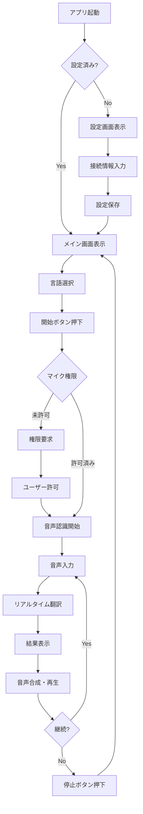
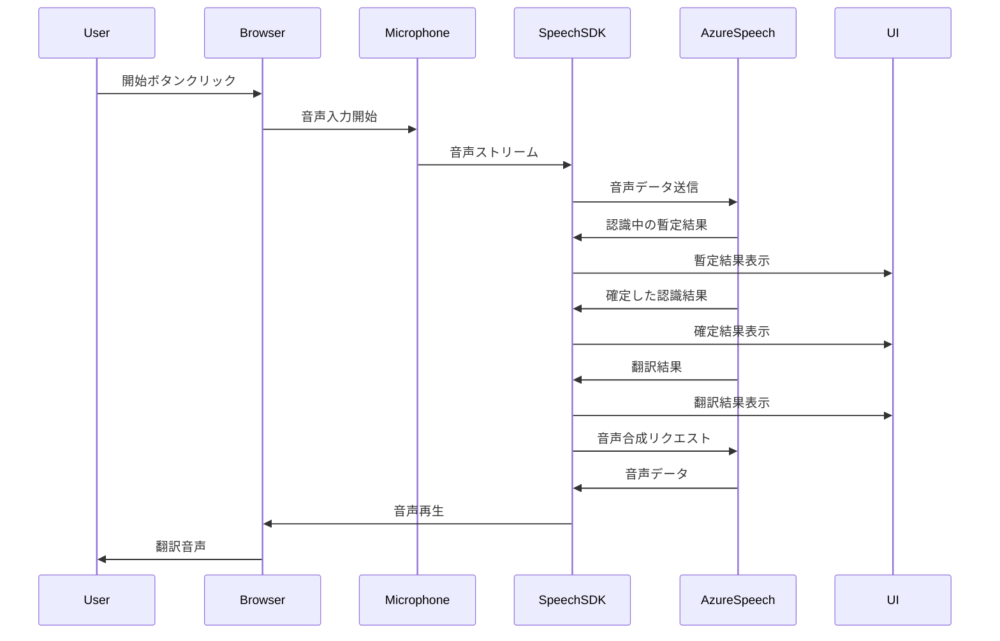

# Azure Speech Service Live Interpreter アプリケーション 企画書・要件定義書

## 📋 目次

1. [プロジェクト概要](#プロジェクト概要)
2. [背景と目的](#背景と目的)
3. [主要機能](#主要機能)
4. [ユーザー体験 (UX)](#ユーザー体験-ux)
5. [ユーザーインターフェース (UI) 仕様](#ユーザーインターフェース-ui-仕様)
6. [技術要件](#技術要件)
7. [セキュリティとプライバシー](#セキュリティとプライバシー)
8. [制約事項](#制約事項)
9. [成功基準](#成功基準)
10. [今後の拡張性](#今後の拡張性)

---

## プロジェクト概要

### プロジェクト名
**Azure Speech Service Live Interpreter** (リアルタイム音声翻訳アプリケーション)

### バージョン
1.0.0

### 概要説明
Azure Speech Service の live interpreter 機能を活用し、マイク入力された音声をリアルタイムで翻訳し、Personal Voice で音声合成して出力するブラウザベースのアプリケーション。言語の壁を超えたコミュニケーションを実現する技術デモンストレーションツール。

### プロジェクトタイプ
技術デモ・サンプルアプリケーション（教育・検証用途）

### 対象ユーザー
- Azure Speech Service の機能を評価したい開発者
- リアルタイム翻訳技術に興味がある技術者
- 多言語コミュニケーションツールの導入を検討する企業担当者
- 技術デモンストレーションを行うプリセールスエンジニア

---

## 背景と目的

### 背景
グローバル化が進む現代において、言語の壁は依然として大きな課題です。Azure Speech Service は強力な音声認識・翻訳・合成機能を提供していますが、これらを統合したシンプルで直感的なデモアプリケーションが求められています。

### 目的
1. **技術的実証**: Azure Speech Service の live interpreter 機能の実用性を示す
2. **開発者支援**: ブラウザベースの実装方法を提供し、開発者の学習を支援
3. **ユーザビリティ検証**: リアルタイム翻訳のUXを検証し、改善点を明確化
4. **迅速なプロトタイピング**: バックエンド不要で即座に動作するデモ環境を提供

### 期待される効果
- Azure Speech Service の採用促進
- 多言語コミュニケーションの障壁低減
- 開発者コミュニティへの技術知識の共有
- カスタム Personal Voice の活用事例提示

---

## 主要機能

### 1. リアルタイム音声認識・翻訳
**機能概要**:
- マイクから入力された音声を Azure Speech Service で認識
- 認識された音声をリアルタイムで指定言語に翻訳
- 認識中の中間結果と確定結果を区別して表示

**ユーザーストーリー**:
> ユーザーとして、マイクに向かって話すと、即座に翻訳結果が画面に表示されることを期待します。

**詳細要件**:
- マイク入力の開始/停止ボタンを提供
- 音声認識の状態（待機中/認識中/停止中）を視覚的に表示
- 認識精度向上のため、適切なサンプリングレートを使用
- ネットワーク遅延を考慮したバッファリング処理

### 2. Personal Voice による音声合成
**機能概要**:
- 翻訳された結果を指定された Personal Voice で音声合成
- 合成された音声を自動再生
- 音声の再生状態を視覚的にフィードバック

**ユーザーストーリー**:
> ユーザーとして、翻訳結果が自然な音声で読み上げられることで、より実用的な体験を得たいです。

**詳細要件**:
- Personal Voice の Speaker ID を設定可能にする
- 音声合成の品質設定（ビットレート、サンプリングレート）
- 音声再生の音量調整機能
- 音声再生のキャンセル/スキップ機能

### 3. チャット形式のUI表示
**機能概要**:
- 元の言語と翻訳結果を吹き出し形式で表示
- 会話の履歴をスクロール可能なタイムライン形式で表示
- 送信者（ユーザー）と受信者（システム）を視覚的に区別

**ユーザーストーリー**:
> ユーザーとして、過去の会話を見返すことができ、どのように翻訳されたかを確認したいです。

**詳細要件**:
- ユーザー発話: 左寄せ、背景色（青系統）
- 翻訳結果: 右寄せ、背景色（緑系統）
- タイムスタンプ表示（オプション）
- 認識中の暫定結果は薄い色で表示し、確定後に濃くする
- 自動スクロール機能（最新のメッセージを自動表示）
- 会話履歴のクリア機能

### 4. 翻訳先言語の選択
**機能概要**:
- ドロップダウンメニューから翻訳先言語を選択
- 一般的に使用される言語をプリセット

**ユーザーストーリー**:
> ユーザーとして、様々な言語に翻訳できることで、多様なシナリオでアプリを活用したいです。

**詳細要件**:
- 対応言語リスト:
  - 日本語 (ja-JP)
  - 英語 (en-US)
  - 中国語簡体字 (zh-CN)
  - 韓国語 (ko-KR)
  - スペイン語 (es-ES)
  - フランス語 (fr-FR)
  - ドイツ語 (de-DE)
  - イタリア語 (it-IT)
  - ポルトガル語 (pt-BR)
  - ロシア語 (ru-RU)
- 言語の表示は「日本語 (ja-JP)」のような形式
- デフォルト言語: 英語 (en-US)
- 音声入力の言語は自動検出または別途選択可能

### 5. 設定の永続化
**機能概要**:
- Azure Speech Service の接続文字列やリージョン情報をブラウザのローカルストレージに保存
- Personal Voice の設定も同様に保存
- アプリケーション起動時に保存された設定を自動読み込み

**ユーザーストーリー**:
> ユーザーとして、毎回設定を入力する手間を省き、すぐに使い始めたいです。

**詳細要件**:
- 保存される設定項目:
  - Speech Service Subscription Key
  - Speech Service Region
  - Personal Voice Speaker ID
  - 翻訳元言語
  - 翻訳先言語
  - 音量設定
- 設定のエクスポート/インポート機能（JSON形式）
- 設定のクリア機能
- 初回起動時に設定ガイドを表示

---

## ユーザー体験 (UX)

### ユーザージャーニー

#### 初回利用時
1. **アプリケーション起動**
   - HTMLファイルをブラウザで開く
   - スプラッシュ画面または初期設定ガイドが表示される

2. **初期設定**
   - 設定アイコンをクリックして設定画面を開く
   - Azure Speech Service の接続文字列を入力
   - Personal Voice の Speaker ID を入力
   - 「保存」ボタンで設定をローカルストレージに保存

3. **マイク権限の許可**
   - 初めて「開始」ボタンを押すと、ブラウザがマイク権限を要求
   - ユーザーが「許可」を選択

4. **翻訳開始**
   - 翻訳先言語を選択
   - 「開始」ボタンをクリック
   - マイクに向かって話す
   - リアルタイムで翻訳結果が表示され、音声が再生される

#### 2回目以降の利用
1. **アプリケーション起動**
   - 保存された設定が自動的に読み込まれる
   - すぐに「開始」ボタンが有効になる

2. **翻訳使用**
   - 必要に応じて翻訳先言語を変更
   - 「開始」ボタンで即座に利用開始

### インタラクションフロー



### エラーハンドリングとフィードバック

#### エラーシナリオ
1. **接続エラー**
   - 症状: Azure Speech Service に接続できない
   - フィードバック: 「接続エラー: 接続文字列とリージョンを確認してください」
   - アクション: 設定画面へのリンクを提供

2. **マイク権限エラー**
   - 症状: マイクへのアクセスが拒否された
   - フィードバック: 「マイクへのアクセスが拒否されました。ブラウザの設定で権限を許可してください」
   - アクション: 権限設定方法のヘルプリンク

3. **翻訳エラー**
   - 症状: 翻訳処理が失敗
   - フィードバック: 「翻訳に失敗しました。もう一度お試しください」
   - アクション: 再試行ボタンを表示

4. **音声合成エラー**
   - 症状: Personal Voice の音声合成が失敗
   - フィードバック: 「音声合成に失敗しました。Speaker ID を確認してください」
   - アクション: 設定画面へのリンク

#### フィードバック方式
- **トースト通知**: 一時的な情報（成功メッセージ等）
- **モーダルダイアログ**: 重要なエラーや確認が必要な場合
- **インラインメッセージ**: フォーム入力のバリデーションエラー
- **ステータスバー**: 現在の動作状態（認識中、待機中等）

---

## ユーザーインターフェース (UI) 仕様

### 画面構成

#### メイン画面レイアウト

```
┌─────────────────────────────────────────────────────────┐
│  🎙️ Azure Speech Interpreter    [⚙️設定] [ℹ️ヘルプ]    │
├─────────────────────────────────────────────────────────┤
│                                                          │
│  翻訳元: [日本語 (ja-JP) ▼]  →  翻訳先: [英語 (en-US) ▼] │
│                                                          │
│  [ ● 開始 ]  [ ■ 停止 ]  [ 🗑️ クリア ]                  │
│                                                          │
├─────────────────────────────────────────────────────────┤
│  会話エリア (スクロール可能)                              │
│                                                          │
│  ┌────────────────────────────┐                        │
│  │ こんにちは                   │ (ユーザー発話)         │
│  │ 12:34                        │                        │
│  └────────────────────────────┘                        │
│                     ┌────────────────────────────┐      │
│                     │ Hello                       │ (翻訳) │
│                     │ 12:34  🔊                  │      │
│                     └────────────────────────────┘      │
│                                                          │
│  ┌────────────────────────────┐                        │
│  │ 今日はいい天気ですね        │                        │
│  │ 12:35                        │                        │
│  └────────────────────────────┘                        │
│                     ┌────────────────────────────┐      │
│                     │ It's a nice day today      │      │
│                     │ 12:35  🔊                  │      │
│                     └────────────────────────────┘      │
│                                                          │
├─────────────────────────────────────────────────────────┤
│  ステータス: 待機中 | 音声認識準備完了                    │
└─────────────────────────────────────────────────────────┘
```

#### 設定画面レイアウト

```
┌─────────────────────────────────────────────────────────┐
│  ⚙️ 設定                                    [×閉じる]    │
├─────────────────────────────────────────────────────────┤
│                                                          │
│  Azure Speech Service 設定                              │
│  ─────────────────────────────────────────             │
│                                                          │
│  Subscription Key *                                     │
│  [________________________________]                     │
│  ℹ️ Azure Portal で取得したキーを入力してください        │
│                                                          │
│  Region *                                               │
│  [________________________________]                     │
│  例: japaneast, eastus                                  │
│                                                          │
│  Personal Voice 設定                                    │
│  ─────────────────────────────────────────             │
│                                                          │
│  Speaker ID                                             │
│  [________________________________]                     │
│  ℹ️ カスタム Personal Voice の ID を入力                │
│                                                          │
│  音声設定                                                │
│  ─────────────────────────────────────────             │
│                                                          │
│  音量                                                    │
│  [────●──────────────────] 70%                         │
│                                                          │
│  ─────────────────────────────────────────             │
│                                                          │
│  [ 保存 ]  [ キャンセル ]  [ 設定をクリア ]              │
│                                                          │
└─────────────────────────────────────────────────────────┘
```

### デザイン仕様

#### カラーパレット
- **プライマリカラー**: `#0078D4` (Azure Blue)
- **セカンダリカラー**: `#50E6FF` (Light Blue)
- **ユーザー吹き出し**: `#E3F2FD` (Light Blue背景), `#1976D2` (境界線)
- **翻訳吹き出し**: `#E8F5E9` (Light Green背景), `#388E3C` (境界線)
- **エラーカラー**: `#D32F2F` (Red)
- **成功カラー**: `#388E3C` (Green)
- **テキストカラー**: `#212121` (Dark Gray)
- **背景カラー**: `#FAFAFA` (Light Gray)

#### タイポグラフィ
- **フォントファミリー**: システムフォント優先
  - `'Segoe UI', 'Noto Sans JP', sans-serif`
- **見出し**: `font-size: 1.5rem`, `font-weight: 600`
- **本文**: `font-size: 1rem`, `font-weight: 400`
- **キャプション**: `font-size: 0.875rem`, `font-weight: 400`

#### スペーシング
- **パディング (小)**: `0.5rem` (8px)
- **パディング (中)**: `1rem` (16px)
- **パディング (大)**: `1.5rem` (24px)
- **マージン (小)**: `0.5rem` (8px)
- **マージン (中)**: `1rem` (16px)
- **マージン (大)**: `2rem` (32px)

#### レスポンシブデザイン

##### モバイル (〜768px)
- 単一カラムレイアウト
- 言語選択を縦並びに
- ボタンをフルワイドに
- フォントサイズを調整 (0.9倍)

##### タブレット (768px〜1024px)
- 2カラムレイアウト（言語選択）
- ボタンサイズを中サイズに
- 会話エリアの幅を調整

##### デスクトップ (1024px〜)
- 最大幅を1200pxに制限
- 中央寄せレイアウト
- 余白を十分に確保

### アクセシビリティ

#### ARIA属性
- ボタンに適切な `aria-label` を設定
- 動的コンテンツに `aria-live` を使用
- フォーム要素に `aria-describedby` でヘルプテキストを関連付け

#### キーボードナビゲーション
- すべてのインタラクティブ要素を Tab キーで操作可能
- フォーカス状態を視覚的に明確に表示
- Enter キーでボタンを実行可能

#### カラーコントラスト
- WCAG 2.1 レベル AA 準拠
- テキストと背景のコントラスト比 4.5:1 以上
- 大きなテキスト（18pt以上）は 3:1 以上

#### スクリーンリーダー対応
- セマンティックHTML要素を使用
- 画像に代替テキストを提供
- フォームラベルを適切に関連付け

---

## 技術要件

### フロントエンド技術スタック

| 技術 | バージョン | 用途 |
|------|-----------|------|
| HTML5 | Latest | セマンティックなマークアップ |
| CSS3 | Latest | スタイリング |
| Tailwind CSS | 3.x (CDN) | ユーティリティファーストCSS |
| JavaScript | ES6+ | アプリケーションロジック |
| Azure Speech SDK | Latest (CDN) | 音声認識・翻訳・合成 |

### Azure Speech SDK 統合

#### SDK読み込み
```html
<script src="https://aka.ms/csspeech/jsbrowserpackageraw"></script>
```

#### 必要な機能
1. **SpeechTranslationConfig**
   - Subscription Key と Region の設定
   - 音声認識の言語設定
   - 翻訳先言語の設定

2. **AudioConfig**
   - デフォルトマイクからの音声入力
   - サンプリングレート: 16kHz推奨

3. **TranslationRecognizer**
   - リアルタイム音声認識と翻訳
   - イベントハンドラー:
     - `recognizing`: 認識中の暫定結果
     - `recognized`: 確定した認識結果
     - `synthesizing`: 音声合成中
     - `canceled`: エラーハンドリング

4. **SpeechSynthesizer** (Personal Voice用)
   - SSML (Speech Synthesis Markup Language) を使用
   - Personal Voice の Speaker ID を指定
   - 音声データの取得と再生

### データフロー



### ローカルストレージ仕様

#### 保存するデータ構造
```javascript
{
  "azureSpeech": {
    "subscriptionKey": "encrypted_or_plain_string",
    "region": "japaneast",
    "personalVoiceSpeakerId": "speaker_id_here"
  },
  "preferences": {
    "sourceLanguage": "ja-JP",
    "targetLanguage": "en-US",
    "volume": 70,
    "autoScroll": true
  },
  "version": "1.0.0"
}
```

#### ストレージキー
- キー名: `azureSpeechInterpreterConfig`
- 最大サイズ: 約5KB（ローカルストレージの制限内）

### エラーハンドリング戦略

#### エラーカテゴリー
1. **設定エラー**: 不正な接続文字列、リージョン
2. **接続エラー**: ネットワーク切断、API制限
3. **権限エラー**: マイクアクセス拒否
4. **認識エラー**: 音声認識失敗、ノイズ
5. **合成エラー**: 音声合成失敗、Personal Voice無効

#### エラー処理フロー
```javascript
try {
  // Azure Speech SDK 処理
} catch (error) {
  console.error('エラー詳細:', error);
  
  // エラータイプに応じた処理
  if (error.code === 'INVALID_KEY') {
    showError('接続情報が無効です。設定を確認してください。');
  } else if (error.code === 'NETWORK_ERROR') {
    showError('ネットワークエラーが発生しました。接続を確認してください。');
  } else {
    showError('予期しないエラーが発生しました。');
  }
  
  // ログ記録
  logError(error);
}
```

### パフォーマンス要件

#### レスポンス時間
- 音声認識開始: 1秒以内
- 暫定結果表示: 500ms以内
- 翻訳結果表示: 2秒以内
- 音声合成開始: 3秒以内

#### リソース使用
- メモリ使用量: 最大100MB
- ネットワーク帯域: 最小1Mbps推奨
- CPU使用率: 通常時30%以下

#### スケーラビリティ
- 会話履歴: 最大100エントリー
- それ以上は古いものから削除
- メモリリークを防ぐための定期的なクリーンアップ

---

## セキュリティとプライバシー

### データセキュリティ

#### 認証情報の取り扱い
- **Subscription Key**: ローカルストレージに保存（技術デモのため許容）
- **暗号化**: 本番環境では Base64 エンコードまたはブラウザAPIを使用
- **警告表示**: 初回設定時に「この情報は他人と共有しないでください」と警告

#### 音声データの取り扱い
- **録音データ**: ブラウザからAzure Speech Serviceに直接ストリーミング
- **ローカル保存なし**: 音声データをローカルに保存しない
- **通信暗号化**: HTTPS/WSS プロトコルで通信

### プライバシー保護

#### データ保持ポリシー
- **会話履歴**: ブラウザメモリ内のみ保持
- **永続化なし**: 会話内容をローカルストレージやサーバーに保存しない
- **セッション終了**: ブラウザを閉じると会話履歴は削除

#### Azure Speech Service のプライバシー
- Microsoft のプライバシーポリシーに準拠
- 音声データの処理はAzureのデータセンターで実行
- データ保持期間: Azure Speech Service の規約に従う

### セキュリティベストプラクティス

1. **XSS対策**
   - ユーザー入力をエスケープ処理
   - `textContent` を使用してDOM操作

2. **HTTPS必須**
   - 本番環境では HTTPS でホスティング
   - マイクアクセスには HTTPS が必要

3. **Content Security Policy**
   - 適切な CSP ヘッダーを設定
   - インラインスクリプトを最小化

4. **依存関係の管理**
   - CDN から読み込むライブラリのバージョンを固定
   - Subresource Integrity (SRI) の使用を検討

### 監査とログ

#### クライアント側ログ
```javascript
// コンソールログレベル
console.log('INFO: 音声認識開始');
console.warn('WARN: ネットワーク遅延検出');
console.error('ERROR: 接続エラー', error);
```

#### ログに含めない情報
- Subscription Key
- Personal Voice Speaker ID
- ユーザーの音声内容（デバッグ時のみ許可）

---

## 制約事項

### 技術的制約

1. **ブラウザ互換性**
   - 対応ブラウザ: Chrome 90+, Edge 90+, Safari 14+, Firefox 88+
   - WebRTC対応ブラウザが必須
   - モバイルブラウザでは制限あり（iOS Safariでのマイクアクセス等）

2. **Azure Speech Service制限**
   - API呼び出し回数制限（Subscription Tierによる）
   - 同時接続数制限
   - 音声合成の文字数制限（約5000文字）
   - Personal Voice の利用には事前の登録が必要

3. **パフォーマンス制約**
   - ネットワーク帯域に依存
   - リアルタイム処理のため遅延が発生する可能性
   - 長時間の連続使用はメモリリークのリスク

### 機能的制約

1. **オフライン動作不可**
   - インターネット接続が必須
   - Azure Speech Service へのアクセスが必要

2. **バックエンドなし**
   - ユーザー管理機能なし
   - 会話履歴の永続化なし
   - 複数デバイス間での同期なし

3. **言語認識**
   - 音声入力の言語は手動選択または自動検出
   - 方言や訛りによる認識精度の低下

### 運用制約

1. **コスト管理**
   - ユーザーが各自のAzure Subscriptionを使用
   - 使用量に応じた課金
   - 本アプリケーションではコスト管理機能を提供しない

2. **サポート範囲**
   - 技術デモ・サンプルアプリケーションとして提供
   - 商用利用には追加の検証が必要
   - Azure Speech Service 自体のサポートは Microsoft に依存

---

## 成功基準

### 機能的成功基準

1. **音声認識精度**
   - 静かな環境での認識精度: 90%以上
   - 標準的な発話速度での認識成功率: 95%以上

2. **翻訳品質**
   - 日常会話レベルの翻訳精度: 実用レベル
   - 専門用語は期待しない

3. **応答性能**
   - 音声認識開始: 1秒以内
   - 翻訳結果表示: 3秒以内（ネットワーク状況による）
   - UI操作のレスポンス: 100ms以内

4. **安定性**
   - 30分間の連続使用でクラッシュしない
   - メモリリークが発生しない
   - エラーから適切に復旧できる

### ユーザビリティ成功基準

1. **学習容易性**
   - 初めてのユーザーが5分以内に基本操作を理解できる
   - 設定画面の入力項目が明確である

2. **効率性**
   - 2回目以降の利用時、30秒以内に翻訳を開始できる
   - 言語切り替えが2クリック以内で完了

3. **満足度**
   - ユーザーインターフェースが直感的で分かりやすい
   - エラーメッセージが理解しやすい

### 技術的成功基準

1. **コード品質**
   - ESLint による静的解析でエラーなし
   - コンソールエラーが発生しない
   - 適切なコメントとドキュメント

2. **互換性**
   - 対応ブラウザで正常に動作
   - レスポンシブデザインが適切に機能

3. **保守性**
   - コードが構造化され、モジュール化されている
   - 将来の機能拡張が容易

---

## 今後の拡張性

### フェーズ2: 機能拡張

1. **会話履歴の保存**
   - ローカルストレージまたはIndexedDBに会話を保存
   - エクスポート機能（JSON, CSV形式）

2. **複数の Personal Voice サポート**
   - 話者ごとに異なる Personal Voice を選択
   - ボイスプロファイルの管理

3. **音声入力の言語自動検出**
   - Azure Speech Service の言語自動検出機能を活用
   - 複数言語の混在会話に対応

4. **テキスト入力モード**
   - キーボードからテキストを入力して翻訳
   - 音声合成のみを実行

### フェーズ3: 高度な機能

1. **会話の分析**
   - 感情分析（Sentiment Analysis）
   - キーワード抽出
   - 会話のサマリー生成

2. **共同翻訳モード**
   - WebRTC を使用した複数ユーザー間のリアルタイム翻訳
   - 会議やイベントでの利用

3. **カスタム用語辞書**
   - 専門用語や固有名詞の翻訳カスタマイズ
   - 業界特有の表現に対応

### フェーズ4: エンタープライズ対応

1. **バックエンド統合**
   - ユーザー管理とAzure AD認証
   - 使用量の追跡とレポート
   - API Gateway による制御

2. **セキュリティ強化**
   - Azure Key Vault による認証情報管理
   - エンドツーエンド暗号化
   - 監査ログの記録

3. **スケーラビリティ**
   - マルチテナント対応
   - Azure Functions によるバックエンド処理
   - Azure Cognitive Services の統合

---

## 付録

### 参考リンク

1. **Azure Speech Service ドキュメント**
   - [Speech Service 概要](https://docs.microsoft.com/azure/cognitive-services/speech-service/)
   - [Speech SDK for JavaScript](https://docs.microsoft.com/azure/cognitive-services/speech-service/quickstarts/setup-platform?pivots=programming-language-javascript)
   - [Personal Voice ドキュメント](https://learn.microsoft.com/azure/ai-services/speech-service/personal-voice-overview)

2. **技術リファレンス**
   - [Web Speech API](https://developer.mozilla.org/docs/Web/API/Web_Speech_API)
   - [Tailwind CSS](https://tailwindcss.com/docs)
   - [LocalStorage API](https://developer.mozilla.org/docs/Web/API/Window/localStorage)

### 用語集

| 用語 | 説明 |
|------|------|
| Live Interpreter | リアルタイムで音声翻訳を行う機能 |
| Personal Voice | ユーザー固有の音声特徴を再現する音声合成技術 |
| Speech-to-Text | 音声をテキストに変換する技術 |
| Text-to-Speech | テキストを音声に変換する技術 |
| SSML | Speech Synthesis Markup Language（音声合成マークアップ言語） |
| Subscription Key | Azure サービスへのアクセスに必要な認証キー |
| Region | Azure データセンターの地理的な場所 |
| WebRTC | リアルタイム通信を実現するWeb技術 |

### 変更履歴

| バージョン | 日付 | 変更内容 | 作成者 |
|----------|------|---------|--------|
| 1.0.0 | 2025-12-04 | 初版作成 | GitHub Copilot Agent |

---

**文書の終わり**
