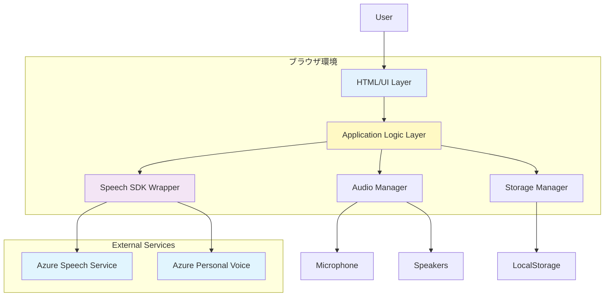
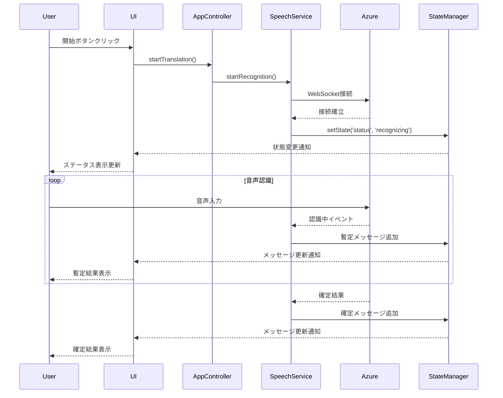

# Azure Speech Service Live Interpreter 技術仕様書

## 📋 目次

1. [システムアーキテクチャ](#システムアーキテクチャ)
2. [技術スタック詳細](#技術スタック詳細)
3. [モジュール設計](#モジュール設計)
4. [データモデル](#データモデル)
5. [API仕様](#api仕様)
6. [ファイル構成](#ファイル構成)
7. [実装詳細](#実装詳細)
8. [テスト戦略](#テスト戦略)
9. [デプロイメント](#デプロイメント)
10. [パフォーマンス最適化](#パフォーマンス最適化)

---

## システムアーキテクチャ

### 全体構成図



### レイヤー構成

#### 1. プレゼンテーション層 (Presentation Layer)
- **責務**: ユーザーインターフェースの描画、ユーザー入力の処理
- **技術**: HTML5, CSS3 (Tailwind CSS), DOM API
- **コンポーネント**:
  - メイン画面 (MainView)
  - 設定モーダル (SettingsModal)
  - 会話表示 (ChatDisplay)
  - 制御パネル (ControlPanel)

#### 2. アプリケーション層 (Application Layer)
- **責務**: ビジネスロジック、状態管理、イベント処理
- **技術**: JavaScript ES6+
- **コンポーネント**:
  - アプリケーションコントローラー (AppController)
  - 状態管理 (StateManager)
  - イベントバス (EventBus)

#### 3. サービス層 (Service Layer)
- **責務**: 外部サービスとの通信、データ処理
- **技術**: Azure Speech SDK
- **コンポーネント**:
  - 音声認識サービス (SpeechRecognitionService)
  - 翻訳サービス (TranslationService)
  - 音声合成サービス (SpeechSynthesisService)

#### 4. データ層 (Data Layer)
- **責務**: データの永続化、キャッシング
- **技術**: LocalStorage API
- **コンポーネント**:
  - ストレージマネージャー (StorageManager)
  - 設定マネージャー (ConfigManager)

---

## 技術スタック詳細

### フロントエンド

#### HTML5
```html
<!DOCTYPE html>
<html lang="ja">
<head>
    <meta charset="UTF-8">
    <meta name="viewport" content="width=device-width, initial-scale=1.0">
    <meta name="description" content="Azure Speech Service Live Interpreter">
    <title>Azure Speech Interpreter</title>
</head>
```

**使用する HTML5 機能**:
- セマンティック要素: `<header>`, `<main>`, `<section>`, `<footer>`
- フォーム要素: `<input>`, `<select>`, `<button>`
- メディア要素: `<audio>` (音声再生用)
- ARIA 属性: アクセシビリティ対応

#### CSS3 with Tailwind CSS
```html
<script src="https://cdn.tailwindcss.com"></script>
<script>
  tailwind.config = {
    theme: {
      extend: {
        colors: {
          'azure-blue': '#0078D4',
          'azure-light': '#50E6FF',
        }
      }
    }
  }
</script>
```

**主要なTailwindユーティリティ**:
- Layout: `flex`, `grid`, `container`
- Spacing: `p-{size}`, `m-{size}`, `space-{axis}-{size}`
- Typography: `text-{size}`, `font-{weight}`, `leading-{size}`
- Colors: `bg-{color}`, `text-{color}`, `border-{color}`
- Responsive: `sm:`, `md:`, `lg:`, `xl:`

#### JavaScript ES6+
```javascript
// モジュール構成
import { SpeechSDK } from 'microsoft-cognitiveservices-speech-sdk';

// 使用する ES6+ 機能
- Class構文
- Arrow Functions
- Template Literals
- Destructuring
- Promises & async/await
- Modules (ES6 modules)
- Spread Operator
- Optional Chaining (?.)
- Nullish Coalescing (??)
```

#### Azure Speech SDK
```html
<script src="https://aka.ms/csspeech/jsbrowserpackageraw"></script>
```

**バージョン**: 1.34.0以上

**主要なクラス**:
- `SpeechTranslationConfig`
- `AudioConfig`
- `TranslationRecognizer`
- `SpeechSynthesizer`
- `SpeechSynthesisOutputFormat`

---

## モジュール設計

### 1. AppController (app-controller.js)

**責務**: アプリケーション全体の制御とライフサイクル管理

```javascript
class AppController {
    constructor() {
        this.stateManager = new StateManager();
        this.speechService = new SpeechRecognitionService();
        this.translationService = new TranslationService();
        this.synthesisService = new SpeechSynthesisService();
        this.storageManager = new StorageManager();
        this.ui = new UIManager();
    }

    async initialize() {
        console.log('INFO: アプリケーション初期化開始');
        await this.loadConfiguration();
        this.setupEventListeners();
        this.ui.render();
        console.log('INFO: アプリケーション初期化完了');
    }

    async startTranslation() {
        console.log('INFO: 翻訳開始');
        try {
            await this.speechService.startRecognition();
            this.stateManager.setState('status', 'recognizing');
        } catch (error) {
            console.error('ERROR: 翻訳開始エラー', error);
            this.ui.showError('翻訳を開始できませんでした。');
        }
    }

    async stopTranslation() {
        console.log('INFO: 翻訳停止');
        await this.speechService.stopRecognition();
        this.stateManager.setState('status', 'idle');
    }

    // その他のメソッド...
}
```

### 2. StateManager (state-manager.js)

**責務**: アプリケーション状態の管理と変更通知

```javascript
class StateManager {
    constructor() {
        this.state = {
            status: 'idle', // idle, recognizing, error
            config: null,
            messages: [],
            sourceLanguage: 'ja-JP',
            targetLanguage: 'en-US',
            volume: 70,
            isConfigured: false
        };
        this.listeners = new Map();
    }

    getState(key) {
        return key ? this.state[key] : { ...this.state };
    }

    setState(key, value) {
        console.log(`INFO: 状態変更 - ${key}:`, value);
        const oldValue = this.state[key];
        this.state[key] = value;
        this.notifyListeners(key, value, oldValue);
    }

    subscribe(key, callback) {
        if (!this.listeners.has(key)) {
            this.listeners.set(key, []);
        }
        this.listeners.get(key).push(callback);
        
        // 購読解除関数を返す
        return () => {
            const callbacks = this.listeners.get(key);
            const index = callbacks.indexOf(callback);
            if (index > -1) {
                callbacks.splice(index, 1);
            }
        };
    }

    notifyListeners(key, newValue, oldValue) {
        const callbacks = this.listeners.get(key) || [];
        callbacks.forEach(callback => callback(newValue, oldValue));
    }

    addMessage(message) {
        this.state.messages.push({
            ...message,
            id: Date.now(),
            timestamp: new Date()
        });
        
        // 最大100件に制限
        if (this.state.messages.length > 100) {
            this.state.messages.shift();
        }
        
        this.notifyListeners('messages', this.state.messages);
    }

    clearMessages() {
        console.log('INFO: メッセージ履歴をクリア');
        this.state.messages = [];
        this.notifyListeners('messages', this.state.messages);
    }
}
```

### 3. SpeechRecognitionService (speech-recognition-service.js)

**責務**: Azure Speech SDK を使用した音声認識と翻訳

```javascript
class SpeechRecognitionService {
    constructor(config) {
        this.config = config;
        this.recognizer = null;
        this.isRecognizing = false;
    }

    async initialize(subscriptionKey, region, sourceLanguage, targetLanguage) {
        console.log('INFO: 音声認識サービス初期化', {
            region,
            sourceLanguage,
            targetLanguage
        });

        try {
            // Speech Translation Config の設定
            const translationConfig = SpeechSDK.SpeechTranslationConfig.fromSubscription(
                subscriptionKey,
                region
            );
            
            translationConfig.speechRecognitionLanguage = sourceLanguage;
            translationConfig.addTargetLanguage(targetLanguage);
            
            // 音声フォーマットの設定
            translationConfig.outputFormat = SpeechSDK.OutputFormat.Detailed;

            // Audio Config の設定
            const audioConfig = SpeechSDK.AudioConfig.fromDefaultMicrophone();

            // Recognizer の作成
            this.recognizer = new SpeechSDK.TranslationRecognizer(
                translationConfig,
                audioConfig
            );

            this.setupEventHandlers();
            
            console.log('INFO: 音声認識サービス初期化完了');
            return true;
        } catch (error) {
            console.error('ERROR: 音声認識サービス初期化エラー', error);
            throw error;
        }
    }

    setupEventHandlers() {
        // 認識中の暫定結果
        this.recognizer.recognizing = (s, e) => {
            console.log('DEBUG: 認識中', e.result.text);
            
            if (this.onRecognizing) {
                this.onRecognizing({
                    text: e.result.text,
                    translation: e.result.translations.get(this.targetLanguage),
                    isFinal: false
                });
            }
        };

        // 確定した認識結果
        this.recognizer.recognized = (s, e) => {
            if (e.result.reason === SpeechSDK.ResultReason.TranslatedSpeech) {
                console.log('INFO: 認識完了', e.result.text);
                
                if (this.onRecognized) {
                    this.onRecognized({
                        text: e.result.text,
                        translation: e.result.translations.get(this.targetLanguage),
                        isFinal: true
                    });
                }
            } else if (e.result.reason === SpeechSDK.ResultReason.NoMatch) {
                console.warn('WARN: 音声が認識されませんでした');
            }
        };

        // エラーハンドリング
        this.recognizer.canceled = (s, e) => {
            console.error('ERROR: 認識がキャンセルされました', e);
            
            if (e.reason === SpeechSDK.CancellationReason.Error) {
                console.error('ERROR詳細:', e.errorDetails);
                if (this.onError) {
                    this.onError(new Error(e.errorDetails));
                }
            }
            
            this.stopRecognition();
        };

        // セッション開始
        this.recognizer.sessionStarted = (s, e) => {
            console.log('INFO: 認識セッション開始');
        };

        // セッション停止
        this.recognizer.sessionStopped = (s, e) => {
            console.log('INFO: 認識セッション停止');
        };
    }

    async startRecognition() {
        if (this.isRecognizing) {
            console.warn('WARN: すでに認識中です');
            return;
        }

        console.log('INFO: 音声認識開始');
        
        try {
            await this.recognizer.startContinuousRecognitionAsync();
            this.isRecognizing = true;
        } catch (error) {
            console.error('ERROR: 音声認識開始エラー', error);
            throw error;
        }
    }

    async stopRecognition() {
        if (!this.isRecognizing) {
            return;
        }

        console.log('INFO: 音声認識停止');
        
        try {
            await this.recognizer.stopContinuousRecognitionAsync();
            this.isRecognizing = false;
        } catch (error) {
            console.error('ERROR: 音声認識停止エラー', error);
        }
    }

    dispose() {
        console.log('INFO: 音声認識サービスをクリーンアップ');
        if (this.recognizer) {
            this.recognizer.close();
            this.recognizer = null;
        }
    }
}
```

### 4. SpeechSynthesisService (speech-synthesis-service.js)

**責務**: Personal Voice を使用した音声合成

```javascript
class SpeechSynthesisService {
    constructor() {
        this.synthesizer = null;
        this.audioElement = null;
    }

    async initialize(subscriptionKey, region, speakerId) {
        console.log('INFO: 音声合成サービス初期化', { region, speakerId });

        try {
            const speechConfig = SpeechSDK.SpeechConfig.fromSubscription(
                subscriptionKey,
                region
            );

            // Personal Voice の設定
            if (speakerId) {
                speechConfig.speechSynthesisVoiceName = speakerId;
            }

            // 音声フォーマットの設定
            speechConfig.speechSynthesisOutputFormat = 
                SpeechSDK.SpeechSynthesisOutputFormat.Audio16Khz32KBitRateMonoMp3;

            this.synthesizer = new SpeechSDK.SpeechSynthesizer(speechConfig);
            
            console.log('INFO: 音声合成サービス初期化完了');
            return true;
        } catch (error) {
            console.error('ERROR: 音声合成サービス初期化エラー', error);
            throw error;
        }
    }

    async synthesizeSpeech(text, language, speakerId) {
        console.log('INFO: 音声合成開始', { text, language, speakerId });

        return new Promise((resolve, reject) => {
            // SSML の生成
            const ssml = this.generateSSML(text, language, speakerId);
            
            this.synthesizer.speakSsmlAsync(
                ssml,
                result => {
                    if (result.reason === SpeechSDK.ResultReason.SynthesizingAudioCompleted) {
                        console.log('INFO: 音声合成完了');
                        
                        // 音声データを再生
                        this.playAudio(result.audioData);
                        resolve(result);
                    } else {
                        console.error('ERROR: 音声合成失敗', result.errorDetails);
                        reject(new Error(result.errorDetails));
                    }
                },
                error => {
                    console.error('ERROR: 音声合成エラー', error);
                    reject(error);
                }
            );
        });
    }

    generateSSML(text, language, speakerId) {
        // Personal Voice を使用する場合の SSML
        if (speakerId) {
            return `
                <speak version="1.0" xmlns="http://www.w3.org/2001/10/synthesis" xml:lang="${language}">
                    <voice name="${speakerId}">
                        ${this.escapeXml(text)}
                    </voice>
                </speak>
            `;
        }
        
        // デフォルトの音声を使用
        return `
            <speak version="1.0" xmlns="http://www.w3.org/2001/10/synthesis" xml:lang="${language}">
                ${this.escapeXml(text)}
            </speak>
        `;
    }

    escapeXml(text) {
        return text
            .replace(/&/g, '&amp;')
            .replace(/</g, '&lt;')
            .replace(/>/g, '&gt;')
            .replace(/"/g, '&quot;')
            .replace(/'/g, '&apos;');
    }

    playAudio(audioData) {
        console.log('INFO: 音声再生開始');
        
        try {
            // Blob を作成
            const blob = new Blob([audioData], { type: 'audio/mp3' });
            const url = URL.createObjectURL(blob);
            
            // Audio 要素を作成して再生
            if (!this.audioElement) {
                this.audioElement = new Audio();
            }
            
            this.audioElement.src = url;
            this.audioElement.play();
            
            // 再生終了後にクリーンアップ
            this.audioElement.onended = () => {
                URL.revokeObjectURL(url);
                console.log('INFO: 音声再生完了');
            };
        } catch (error) {
            console.error('ERROR: 音声再生エラー', error);
        }
    }

    setVolume(volume) {
        if (this.audioElement) {
            this.audioElement.volume = volume / 100;
            console.log('INFO: 音量設定', volume);
        }
    }

    stopAudio() {
        if (this.audioElement) {
            this.audioElement.pause();
            this.audioElement.currentTime = 0;
            console.log('INFO: 音声再生停止');
        }
    }

    dispose() {
        console.log('INFO: 音声合成サービスをクリーンアップ');
        this.stopAudio();
        
        if (this.synthesizer) {
            this.synthesizer.close();
            this.synthesizer = null;
        }
    }
}
```

### 5. StorageManager (storage-manager.js)

**責務**: ローカルストレージへのデータ保存と読み込み

```javascript
class StorageManager {
    constructor() {
        this.storageKey = 'azureSpeechInterpreterConfig';
        this.version = '1.0.0';
    }

    saveConfiguration(config) {
        console.log('INFO: 設定を保存');
        
        try {
            const data = {
                version: this.version,
                azureSpeech: {
                    subscriptionKey: config.subscriptionKey,
                    region: config.region,
                    personalVoiceSpeakerId: config.personalVoiceSpeakerId
                },
                preferences: {
                    sourceLanguage: config.sourceLanguage,
                    targetLanguage: config.targetLanguage,
                    volume: config.volume,
                    autoScroll: config.autoScroll !== false
                },
                savedAt: new Date().toISOString()
            };

            localStorage.setItem(this.storageKey, JSON.stringify(data));
            console.log('INFO: 設定の保存完了');
            return true;
        } catch (error) {
            console.error('ERROR: 設定の保存エラー', error);
            return false;
        }
    }

    loadConfiguration() {
        console.log('INFO: 設定を読み込み');
        
        try {
            const data = localStorage.getItem(this.storageKey);
            
            if (!data) {
                console.log('INFO: 保存された設定がありません');
                return null;
            }

            const config = JSON.parse(data);
            
            // バージョンチェック
            if (config.version !== this.version) {
                console.warn('WARN: 設定のバージョンが異なります。マイグレーションが必要かもしれません。');
            }

            console.log('INFO: 設定の読み込み完了');
            return config;
        } catch (error) {
            console.error('ERROR: 設定の読み込みエラー', error);
            return null;
        }
    }

    clearConfiguration() {
        console.log('INFO: 設定をクリア');
        
        try {
            localStorage.removeItem(this.storageKey);
            console.log('INFO: 設定のクリア完了');
            return true;
        } catch (error) {
            console.error('ERROR: 設定のクリアエラー', error);
            return false;
        }
    }

    exportConfiguration() {
        console.log('INFO: 設定をエクスポート');
        const config = this.loadConfiguration();
        
        if (!config) {
            return null;
        }

        // Subscription Key を除外（セキュリティ）
        const exportData = {
            ...config,
            azureSpeech: {
                ...config.azureSpeech,
                subscriptionKey: '***HIDDEN***'
            }
        };

        return JSON.stringify(exportData, null, 2);
    }

    importConfiguration(jsonString) {
        console.log('INFO: 設定をインポート');
        
        try {
            const config = JSON.parse(jsonString);
            
            // バリデーション
            if (!this.validateConfiguration(config)) {
                throw new Error('無効な設定形式です');
            }

            localStorage.setItem(this.storageKey, jsonString);
            console.log('INFO: 設定のインポート完了');
            return true;
        } catch (error) {
            console.error('ERROR: 設定のインポートエラー', error);
            return false;
        }
    }

    validateConfiguration(config) {
        // 必須フィールドのチェック
        return config &&
               config.azureSpeech &&
               config.preferences &&
               typeof config.azureSpeech.region === 'string' &&
               typeof config.preferences.sourceLanguage === 'string' &&
               typeof config.preferences.targetLanguage === 'string';
    }
}
```

### 6. UIManager (ui-manager.js)

**責務**: ユーザーインターフェースの描画と更新

```javascript
class UIManager {
    constructor(stateManager) {
        this.stateManager = stateManager;
        this.elements = {};
        this.initializeElements();
        this.setupEventListeners();
    }

    initializeElements() {
        // DOM要素の取得
        this.elements = {
            startButton: document.getElementById('startButton'),
            stopButton: document.getElementById('stopButton'),
            clearButton: document.getElementById('clearButton'),
            settingsButton: document.getElementById('settingsButton'),
            sourceLanguageSelect: document.getElementById('sourceLanguage'),
            targetLanguageSelect: document.getElementById('targetLanguage'),
            chatContainer: document.getElementById('chatContainer'),
            statusBar: document.getElementById('statusBar'),
            settingsModal: document.getElementById('settingsModal'),
            // 設定フォーム要素
            subscriptionKeyInput: document.getElementById('subscriptionKey'),
            regionInput: document.getElementById('region'),
            speakerIdInput: document.getElementById('speakerId'),
            volumeSlider: document.getElementById('volume'),
            volumeValue: document.getElementById('volumeValue')
        };
    }

    setupEventListeners() {
        // 状態変更の購読
        this.stateManager.subscribe('status', (status) => {
            this.updateStatus(status);
        });

        this.stateManager.subscribe('messages', (messages) => {
            this.renderMessages(messages);
        });

        // 音量スライダー
        this.elements.volumeSlider?.addEventListener('input', (e) => {
            const volume = e.target.value;
            this.elements.volumeValue.textContent = `${volume}%`;
        });
    }

    updateStatus(status) {
        console.log('INFO: ステータス更新', status);
        
        const statusMessages = {
            idle: '待機中',
            recognizing: '認識中...',
            error: 'エラー'
        };

        if (this.elements.statusBar) {
            this.elements.statusBar.textContent = `ステータス: ${statusMessages[status] || status}`;
        }

        // ボタンの有効/無効化
        if (this.elements.startButton && this.elements.stopButton) {
            this.elements.startButton.disabled = status === 'recognizing';
            this.elements.stopButton.disabled = status !== 'recognizing';
        }
    }

    renderMessages(messages) {
        console.log('INFO: メッセージを描画', messages.length);
        
        if (!this.elements.chatContainer) {
            return;
        }

        // コンテナをクリア
        this.elements.chatContainer.innerHTML = '';

        // メッセージを描画
        messages.forEach(message => {
            this.appendMessage(message);
        });

        // 自動スクロール
        if (this.stateManager.getState('autoScroll')) {
            this.scrollToBottom();
        }
    }

    appendMessage(message) {
        const messageDiv = document.createElement('div');
        messageDiv.className = 'mb-4';

        // ユーザー発話
        if (message.type === 'user') {
            messageDiv.innerHTML = `
                <div class="flex justify-start">
                    <div class="max-w-md bg-blue-100 border border-blue-300 rounded-lg p-3 shadow">
                        <div class="text-gray-800 break-words">${this.escapeHtml(message.text)}</div>
                        <div class="text-xs text-gray-500 mt-1">${this.formatTime(message.timestamp)}</div>
                    </div>
                </div>
            `;
        }
        // 翻訳結果
        else if (message.type === 'translation') {
            messageDiv.innerHTML = `
                <div class="flex justify-end">
                    <div class="max-w-md bg-green-100 border border-green-300 rounded-lg p-3 shadow">
                        <div class="text-gray-800 break-words">${this.escapeHtml(message.text)}</div>
                        <div class="text-xs text-gray-500 mt-1 flex items-center justify-between">
                            <span>${this.formatTime(message.timestamp)}</span>
                            <span class="ml-2">🔊</span>
                        </div>
                    </div>
                </div>
            `;
        }

        this.elements.chatContainer.appendChild(messageDiv);
    }

    scrollToBottom() {
        if (this.elements.chatContainer) {
            this.elements.chatContainer.scrollTop = this.elements.chatContainer.scrollHeight;
        }
    }

    showError(message) {
        console.error('ERROR: UI エラー表示', message);
        
        // トースト通知を表示
        this.showToast(message, 'error');
    }

    showSuccess(message) {
        console.log('INFO: UI 成功表示', message);
        this.showToast(message, 'success');
    }

    showToast(message, type = 'info') {
        const toast = document.createElement('div');
        toast.className = `fixed top-4 right-4 p-4 rounded-lg shadow-lg z-50 ${
            type === 'error' ? 'bg-red-500' :
            type === 'success' ? 'bg-green-500' :
            'bg-blue-500'
        } text-white`;
        
        toast.textContent = message;
        document.body.appendChild(toast);

        // 3秒後に削除
        setTimeout(() => {
            toast.remove();
        }, 3000);
    }

    openSettingsModal() {
        if (this.elements.settingsModal) {
            this.elements.settingsModal.classList.remove('hidden');
        }
    }

    closeSettingsModal() {
        if (this.elements.settingsModal) {
            this.elements.settingsModal.classList.add('hidden');
        }
    }

    escapeHtml(text) {
        const div = document.createElement('div');
        div.textContent = text;
        return div.innerHTML;
    }

    formatTime(timestamp) {
        const date = new Date(timestamp);
        return date.toLocaleTimeString('ja-JP', {
            hour: '2-digit',
            minute: '2-digit'
        });
    }
}
```

---

## データモデル

### Configuration Model

```typescript
interface Configuration {
    version: string;
    azureSpeech: AzureSpeechConfig;
    preferences: UserPreferences;
    savedAt: string; // ISO 8601 format
}

interface AzureSpeechConfig {
    subscriptionKey: string;
    region: string;
    personalVoiceSpeakerId?: string;
}

interface UserPreferences {
    sourceLanguage: string; // BCP-47 language tag
    targetLanguage: string; // BCP-47 language tag
    volume: number; // 0-100
    autoScroll: boolean;
}
```

### Message Model

```typescript
interface Message {
    id: number;
    type: 'user' | 'translation' | 'system';
    text: string;
    timestamp: Date;
    isFinal: boolean;
    language?: string;
}
```

### Application State Model

```typescript
interface ApplicationState {
    status: 'idle' | 'recognizing' | 'error';
    config: Configuration | null;
    messages: Message[];
    sourceLanguage: string;
    targetLanguage: string;
    volume: number;
    isConfigured: boolean;
}
```

---

## API仕様

### Azure Speech Service API

#### Speech Translation API

**エンドポイント**: WebSocket接続
- `wss://{region}.stt.speech.microsoft.com/speech/translation/cognitiveservices/v1`

**認証**:
- Subscription Key ヘッダー: `Ocp-Apim-Subscription-Key: {key}`

**パラメータ**:
- `from`: 音声入力の言語 (例: `ja-JP`)
- `to`: 翻訳先の言語 (例: `en`)
- `format`: 出力フォーマット (`detailed` 推奨)

**レスポンス**:
```json
{
    "RecognitionStatus": "Success",
    "Offset": 12345678,
    "Duration": 12345678,
    "DisplayText": "こんにちは",
    "Translation": {
        "en": "Hello"
    }
}
```

#### Speech Synthesis API (Personal Voice)

**エンドポイント**: HTTPS
- `https://{region}.tts.speech.microsoft.com/cognitiveservices/v1`

**リクエスト**:
```xml
<speak version="1.0" xmlns="http://www.w3.org/2001/10/synthesis" xml:lang="en-US">
    <voice name="{personalVoiceSpeakerId}">
        Hello
    </voice>
</speak>
```

**レスポンス**: Audio/MP3 バイナリデータ

---

## ファイル構成

```
/home/runner/work/personalvoice-translator/personalvoice-translator/
├── docs/
│   ├── RequirementsDefinition.md    # 企画書・要件定義書
│   └── techspec.md                   # 技術仕様書（本ファイル）
├── src/
│   ├── index.html                    # メインHTMLファイル
│   ├── css/
│   │   └── styles.css                # カスタムCSS
│   ├── js/
│   │   ├── app.js                    # エントリーポイント
│   │   ├── app-controller.js         # アプリケーションコントローラー
│   │   ├── state-manager.js          # 状態管理
│   │   ├── speech-recognition-service.js  # 音声認識サービス
│   │   ├── speech-synthesis-service.js    # 音声合成サービス
│   │   ├── storage-manager.js        # ストレージ管理
│   │   ├── ui-manager.js             # UI管理
│   │   └── constants.js              # 定数定義
│   └── assets/
│       └── images/
│           └── logo.png              # アプリケーションロゴ
├── LICENSE
└── README.md
```

---

## 実装詳細

### 初期化フロー

```javascript
// src/js/app.js
document.addEventListener('DOMContentLoaded', async () => {
    console.log('INFO: アプリケーション起動');
    
    try {
        // コントローラーの初期化
        const app = new AppController();
        await app.initialize();
        
        // グローバルスコープに登録（デバッグ用）
        window.app = app;
        
        console.log('INFO: アプリケーション起動完了');
    } catch (error) {
        console.error('FATAL: アプリケーション初期化エラー', error);
        alert('アプリケーションの初期化に失敗しました。ページを再読み込みしてください。');
    }
});
```

### イベントフロー



### エラーハンドリングフロー

```javascript
class ErrorHandler {
    static handle(error, context) {
        console.error(`ERROR in ${context}:`, error);
        
        // エラータイプに応じた処理
        switch (error.code) {
            case 'InvalidSubscriptionKey':
                return {
                    message: 'Subscription Key が無効です。設定を確認してください。',
                    action: 'openSettings'
                };
            
            case 'ConnectionFailure':
                return {
                    message: 'Azure Speech Service への接続に失敗しました。ネットワーク接続を確認してください。',
                    action: 'retry'
                };
            
            case 'PermissionDenied':
                return {
                    message: 'マイクへのアクセスが拒否されました。ブラウザの設定で権限を許可してください。',
                    action: 'showHelp'
                };
            
            case 'RuntimeError':
            default:
                return {
                    message: '予期しないエラーが発生しました。もう一度お試しください。',
                    action: 'none'
                };
        }
    }
}
```

---

## テスト戦略

### テストの種類

#### 1. 手動テスト

**ブラウザ互換性テスト**:
- Chrome 90+ (Windows, macOS, Linux)
- Edge 90+ (Windows, macOS)
- Safari 14+ (macOS, iOS)
- Firefox 88+ (Windows, macOS, Linux)

**機能テスト**:
| テストケース | 手順 | 期待結果 |
|------------|------|---------|
| 初回起動 | HTMLファイルを開く | 設定画面が表示される |
| 設定保存 | 接続情報を入力して保存 | LocalStorageに保存される |
| 音声認識開始 | 開始ボタンをクリック | マイク権限要求が表示される |
| 音声認識 | マイクに向かって話す | リアルタイムで翻訳結果が表示される |
| 音声合成 | 翻訳結果が表示される | 音声が再生される |
| 言語変更 | ドロップダウンから言語を選択 | 選択した言語で翻訳される |

**エラーハンドリングテスト**:
- 無効な Subscription Key
- ネットワーク切断
- マイク権限拒否
- 長時間の連続使用

#### 2. パフォーマンステスト

**測定項目**:
- 初期ロード時間: < 2秒
- 音声認識開始時間: < 1秒
- 翻訳表示時間: < 3秒
- メモリ使用量: < 100MB
- CPU使用率: < 30%

**測定方法**:
- Chrome DevTools Performance タブ
- Memory タブでメモリリーク検証
- Network タブでネットワーク使用量確認

#### 3. セキュリティテスト

**検証項目**:
- XSS脆弱性: ユーザー入力のエスケープ処理
- LocalStorage セキュリティ: 機密情報の保護
- HTTPS強制: マイクアクセスの要件
- CSP (Content Security Policy) の適用

### テストログ

```javascript
// テスト用のログ出力
class TestLogger {
    static logTestResult(testName, passed, details) {
        const result = passed ? '✓ PASS' : '✗ FAIL';
        console.log(`[TEST] ${result}: ${testName}`);
        if (details) {
            console.log(`  Details: ${details}`);
        }
    }

    static logPerformance(metric, value, threshold) {
        const passed = value < threshold;
        const result = passed ? '✓' : '✗';
        console.log(`[PERF] ${result} ${metric}: ${value}ms (threshold: ${threshold}ms)`);
    }
}
```

---

## デプロイメント

### ホスティングオプション

#### 1. GitHub Pages（推奨）
```bash
# リポジトリ設定
git init
git add .
git commit -m "Initial commit"
git branch -M main
git remote add origin https://github.com/username/azure-speech-interpreter.git
git push -u origin main

# GitHub Pages 有効化
# Settings > Pages > Source: main branch / src folder
```

アクセスURL: `https://username.github.io/azure-speech-interpreter/`

#### 2. Azure Static Web Apps
```bash
# Azure CLI を使用
az login
az staticwebapp create \
    --name azure-speech-interpreter \
    --resource-group myResourceGroup \
    --source https://github.com/username/azure-speech-interpreter \
    --location "East Asia" \
    --branch main \
    --app-location "/src" \
    --output-location ""
```

#### 3. ローカル開発サーバー
```bash
# Python を使用
cd src
python -m http.server 8000

# または Node.js http-server
npx http-server ./src -p 8000
```

アクセスURL: `http://localhost:8000`

### デプロイメントチェックリスト

- [ ] すべての依存関係がCDN経由で読み込まれている
- [ ] HTMLファイルがUTF-8エンコーディングで保存されている
- [ ] 相対パスが正しく設定されている
- [ ] Console.logが適切に配置されている
- [ ] エラーハンドリングが実装されている
- [ ] レスポンシブデザインが正しく動作する
- [ ] ブラウザ互換性テストが完了している
- [ ] セキュリティチェックが完了している
- [ ] ドキュメントが最新である

---

## パフォーマンス最適化

### 1. 初期ロード最適化

```html
<!-- 非同期読み込み -->
<script src="https://cdn.tailwindcss.com" defer></script>
<script src="https://aka.ms/csspeech/jsbrowserpackageraw" defer></script>

<!-- リソースヒント -->
<link rel="preconnect" href="https://cdn.tailwindcss.com">
<link rel="preconnect" href="https://aka.ms">
<link rel="dns-prefetch" href="https://{region}.stt.speech.microsoft.com">
<link rel="dns-prefetch" href="https://{region}.tts.speech.microsoft.com">
```

### 2. メモリ管理

```javascript
class MemoryManager {
    static cleanup() {
        console.log('INFO: メモリクリーンアップ実行');
        
        // 古いメッセージを削除
        const messages = stateManager.getState('messages');
        if (messages.length > 100) {
            const trimmed = messages.slice(-100);
            stateManager.setState('messages', trimmed);
        }
        
        // 未使用の Audio 要素を削除
        const audioElements = document.querySelectorAll('audio');
        audioElements.forEach(audio => {
            if (audio.ended) {
                audio.remove();
            }
        });
    }

    static startPeriodicCleanup() {
        // 5分ごとにクリーンアップ
        setInterval(() => {
            MemoryManager.cleanup();
        }, 5 * 60 * 1000);
    }
}
```

### 3. ネットワーク最適化

```javascript
// 接続の再利用
class ConnectionPool {
    constructor() {
        this.recognizer = null;
        this.synthesizer = null;
    }

    getRecognizer(config) {
        if (!this.recognizer || this.configChanged(config)) {
            this.recognizer = this.createRecognizer(config);
        }
        return this.recognizer;
    }

    // 接続を使い回す
    reuseConnection() {
        // WebSocket接続を維持
        // 必要に応じて再接続
    }
}
```

### 4. UI レンダリング最適化

```javascript
// 仮想スクロール（メッセージが多い場合）
class VirtualScroll {
    constructor(container, items, renderItem) {
        this.container = container;
        this.items = items;
        this.renderItem = renderItem;
        this.visibleRange = { start: 0, end: 20 };
    }

    render() {
        // 表示範囲内のアイテムのみレンダリング
        const fragment = document.createDocumentFragment();
        
        for (let i = this.visibleRange.start; i < this.visibleRange.end; i++) {
            if (this.items[i]) {
                fragment.appendChild(this.renderItem(this.items[i]));
            }
        }
        
        this.container.innerHTML = '';
        this.container.appendChild(fragment);
    }

    updateVisibleRange() {
        // スクロール位置に基づいて表示範囲を更新
        const scrollTop = this.container.scrollTop;
        const itemHeight = 80; // 平均的なメッセージの高さ
        
        this.visibleRange.start = Math.floor(scrollTop / itemHeight);
        this.visibleRange.end = this.visibleRange.start + 20;
        
        this.render();
    }
}
```

---

## セキュリティ考慮事項

### 1. XSS対策

```javascript
// すべてのユーザー入力をエスケープ
function escapeHtml(text) {
    const div = document.createElement('div');
    div.textContent = text;
    return div.innerHTML;
}

// textContent を使用
element.textContent = userInput; // 安全
// element.innerHTML = userInput; // 危険
```

### 2. Content Security Policy

```html
<meta http-equiv="Content-Security-Policy" content="
    default-src 'self';
    script-src 'self' 'unsafe-inline' https://cdn.tailwindcss.com https://aka.ms;
    style-src 'self' 'unsafe-inline' https://cdn.tailwindcss.com;
    connect-src 'self' https://*.speech.microsoft.com wss://*.speech.microsoft.com;
    media-src 'self' blob:;
    font-src 'self' data:;
">
```

### 3. Subscription Key の保護

```javascript
// 本番環境での推奨事項
class SecureStorage {
    static saveKey(key) {
        // Base64エンコード（最小限の難読化）
        const encoded = btoa(key);
        localStorage.setItem('key', encoded);
        
        // 警告表示
        console.warn('WARNING: Subscription Keyがローカルに保存されました。このデバイスは信頼できるデバイスですか？');
    }

    static loadKey() {
        const encoded = localStorage.getItem('key');
        return encoded ? atob(encoded) : null;
    }
}
```

---

## トラブルシューティング

### よくある問題と解決方法

#### 1. マイクが動作しない
**症状**: 音声認識が開始されない

**解決方法**:
- ブラウザのマイク権限を確認
- HTTPSでホスティングされているか確認
- 他のアプリケーションがマイクを使用していないか確認
- ブラウザコンソールでエラーを確認

#### 2. 接続エラー
**症状**: "ConnectionFailure" エラー

**解決方法**:
- Subscription Key が正しいか確認
- Region が正しいか確認（例: `japaneast`）
- ネットワーク接続を確認
- ファイアウォール設定を確認

#### 3. Personal Voice が動作しない
**症状**: 音声合成が失敗する

**解決方法**:
- Speaker ID が正しいか確認
- Personal Voice が有効化されているか確認
- サブスクリプションに Personal Voice の権限があるか確認

#### 4. メモリリーク
**症状**: 長時間使用後にブラウザが遅くなる

**解決方法**:
- 定期的にメッセージ履歴をクリア
- ブラウザを再起動
- メモリクリーンアップ機能を実装

### デバッグ方法

```javascript
// デバッグモードの有効化
window.DEBUG_MODE = true;

if (window.DEBUG_MODE) {
    console.log('DEBUG: 詳細ログを出力します');
    
    // すべてのイベントをログ
    window.addEventListener('*', (e) => {
        console.log('EVENT:', e.type, e);
    });
}
```

---

## 変更履歴

| バージョン | 日付 | 変更内容 | 作成者 |
|----------|------|---------|--------|
| 1.0.0 | 2025-12-04 | 初版作成 | GitHub Copilot Agent |

---

**文書の終わり**
